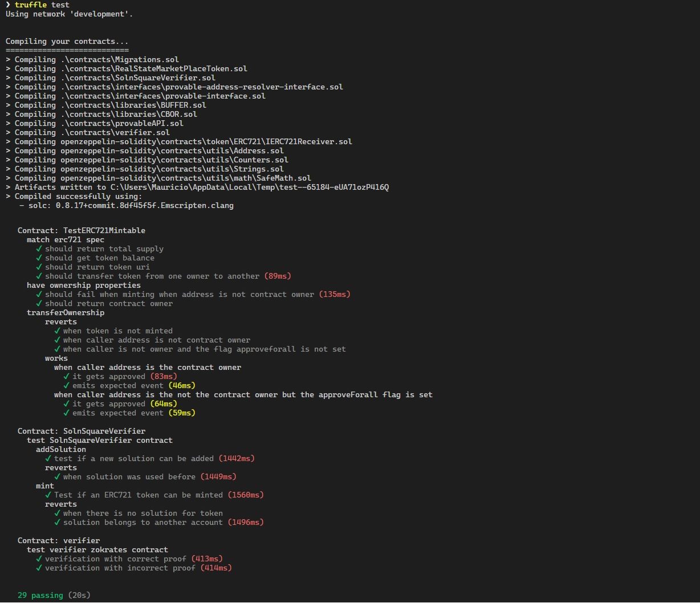
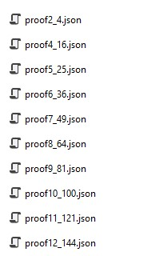
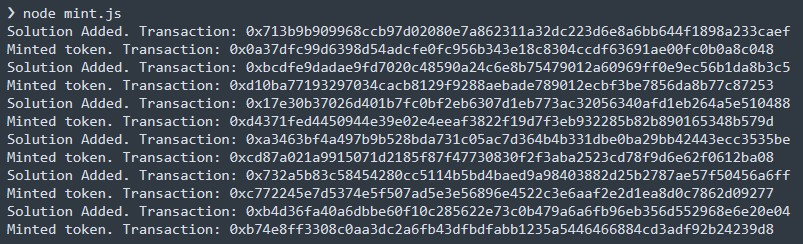
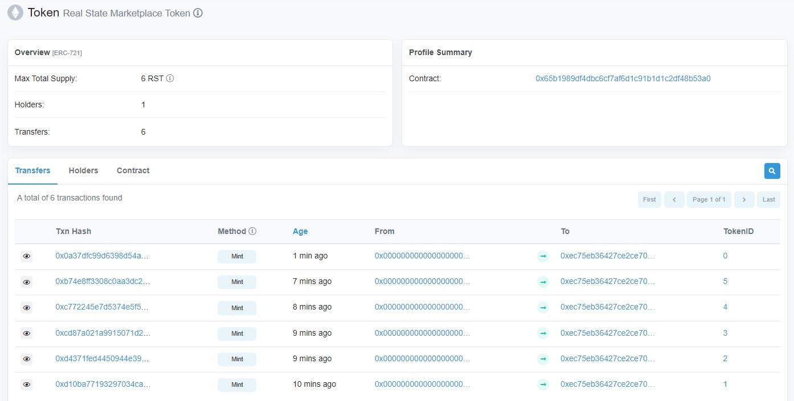
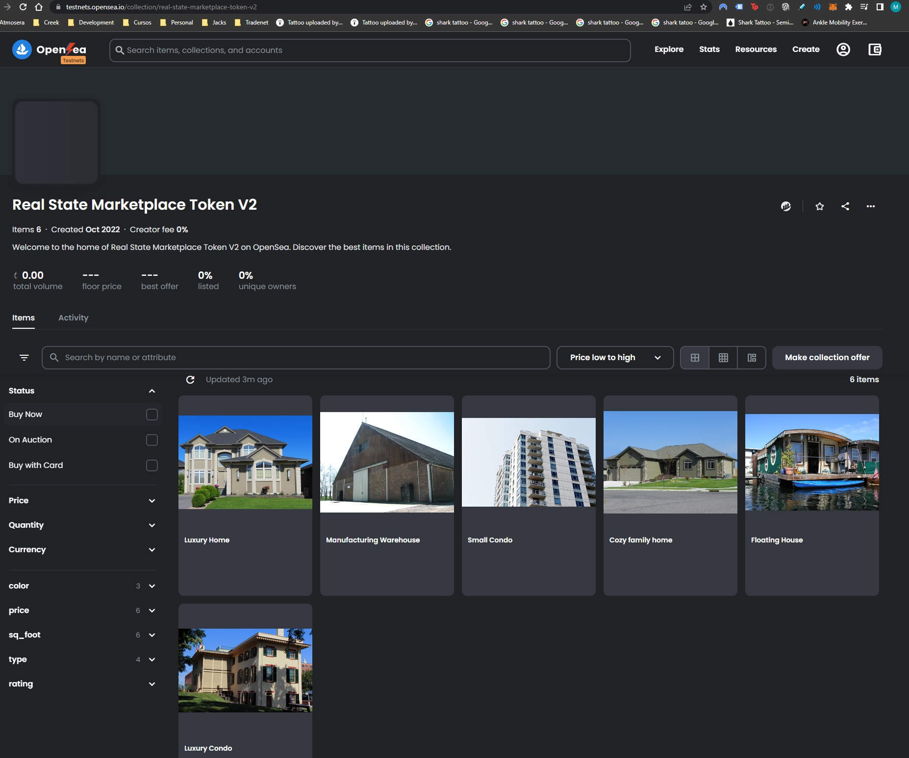
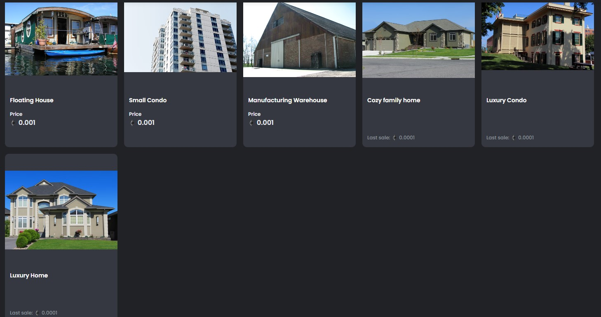

Real Estate Marketplace
=======================

The capstone will build upon the knowledge you have gained in the course in
order to build a decentralized housing product.

Project Steps
-------------

1.  Clone the project repository

Dependencies

~~~~~~~~~~~~~~~~~~~~~~~~~~~~~~~~~~~~~~~~~~~~~~~~~~~~~~~~~~~~~~~~~~~~~~~~~~~~~~~~
truffle, 5.5.31
ganache, 7.4.3
Node, 16.17.1
@truffle/hdwallet-provider, 2.0.14
truffle-assertions, 0.9.2
dotenv, 16.0.2
openzeppelin-solidity, 4.6.0
solc, 0.8.17
solc-js, 1.0.1
web3, 1.8.0
~~~~~~~~~~~~~~~~~~~~~~~~~~~~~~~~~~~~~~~~~~~~~~~~~~~~~~~~~~~~~~~~~~~~~~~~~~~~~~~~

To install and compile the contracts, run the following commands:

~~~~~~~~~~~~~~~~~~~~~~~~~~~~~~~~~~~~~~~~~~~~~~~~~~~~~~~~~~~~~~~~~~~~~~~~~~~ bash
npm install
~~~~~~~~~~~~~~~~~~~~~~~~~~~~~~~~~~~~~~~~~~~~~~~~~~~~~~~~~~~~~~~~~~~~~~~~~~~~~~~~

Unit Tests
----------

I created unit tests for the requested functionality. To check those tests you
need to start ganache in a terminal with the following command.

~~~~~~~~~~~~~~~~~~~~~~~~~~~~~~~~~~~~~~~~~~~~~~~~~~~~~~~~~~~~~~~~~~~~~~~~~~~ bash
ganache -a 40 -l 9999999 -m "candy maple cake sugar pudding cream honey rich smooth crumble sweet treat"
~~~~~~~~~~~~~~~~~~~~~~~~~~~~~~~~~~~~~~~~~~~~~~~~~~~~~~~~~~~~~~~~~~~~~~~~~~~~~~~~

Then execute the tests running, this command compiles and then tests the
contracts:

~~~~~~~~~~~~~~~~~~~~~~~~~~~~~~~~~~~~~~~~~~~~~~~~~~~~~~~~~~~~~~~~~~~~~~~~~~~ bash
truffle test
~~~~~~~~~~~~~~~~~~~~~~~~~~~~~~~~~~~~~~~~~~~~~~~~~~~~~~~~~~~~~~~~~~~~~~~~~~~~~~~~

Implement ZoKrates
------------------

-   Step 1: Install and execute Docker

-   Step 2: Run ZoKrates (you need to change the directory for the one where you
    have the project cloned.

    ~~~~~~~~~~~~~~~~~~~~~~~~~~~~~~~~~~~~~~~~~~~~~~~~~~~~~~~~~~~~~~~~~~~~~~~~~~~~
    docker run -v E:\codePlayground\Blockchain\realstatemarketplace\Blockchain-Capstone\zokrates\code:/home/zokrates/code -ti zokrates/zokrates /bin/bash
    ~~~~~~~~~~~~~~~~~~~~~~~~~~~~~~~~~~~~~~~~~~~~~~~~~~~~~~~~~~~~~~~~~~~~~~~~~~~~

    Change into the square directory

    ~~~~~~~~~~~~~~~~~~~~~~~~~~~~~~~~~~~~~~~~~~~~~~~~~~~~~~~~~~~~~~~~~~~~~~~~~~~~
    cd code/square/
    ~~~~~~~~~~~~~~~~~~~~~~~~~~~~~~~~~~~~~~~~~~~~~~~~~~~~~~~~~~~~~~~~~~~~~~~~~~~~

-   Step 3: Compile the program written in ZoKrates DSL

    ~~~~~~~~~~~~~~~~~~~~~~~~~~~~~~~~~~~~~~~~~~~~~~~~~~~~~~~~~~~~~~~~~~~~~~~~~~~~
    ~/zokrates compile -i square.code
    ~~~~~~~~~~~~~~~~~~~~~~~~~~~~~~~~~~~~~~~~~~~~~~~~~~~~~~~~~~~~~~~~~~~~~~~~~~~~

-   Step 4: Generate the trusted setup

    ~~~~~~~~~~~~~~~~~~~~~~~~~~~~~~~~~~~~~~~~~~~~~~~~~~~~~~~~~~~~~~~~~~~~~~~~~~~~
    ~/zokrates setup
    ~~~~~~~~~~~~~~~~~~~~~~~~~~~~~~~~~~~~~~~~~~~~~~~~~~~~~~~~~~~~~~~~~~~~~~~~~~~~

-   Step 5: Compute witness. I created 10 proofs in the sub directory of the
    same name for the values from 2 to 12 and their corresponding square value.

    ~~~~~~~~~~~~~~~~~~~~~~~~~~~~~~~~~~~~~~~~~~~~~~~~~~~~~~~~~~~~~~~~~~~~~~~~~~~~
    ~/zokrates compute-witness -a 2 4
    ~~~~~~~~~~~~~~~~~~~~~~~~~~~~~~~~~~~~~~~~~~~~~~~~~~~~~~~~~~~~~~~~~~~~~~~~~~~~

-   Step 6: Generate proof

    ~~~~~~~~~~~~~~~~~~~~~~~~~~~~~~~~~~~~~~~~~~~~~~~~~~~~~~~~~~~~~~~~~~~~~~~~~~~~
    ~/zokrates generate-proof
    ~~~~~~~~~~~~~~~~~~~~~~~~~~~~~~~~~~~~~~~~~~~~~~~~~~~~~~~~~~~~~~~~~~~~~~~~~~~~

-   Step 7: Export verifier

    ~~~~~~~~~~~~~~~~~~~~~~~~~~~~~~~~~~~~~~~~~~~~~~~~~~~~~~~~~~~~~~~~~~~~~~~~~~~~
    ~/zokrates export-verifier --output proof2_4.json
    ~~~~~~~~~~~~~~~~~~~~~~~~~~~~~~~~~~~~~~~~~~~~~~~~~~~~~~~~~~~~~~~~~~~~~~~~~~~~

Deployment to Goerli
--------------------

The original description of the project talks about deploying to Rinkeby, but
opensea works now with Goerli, so I deployed and tested using this test network.

If you are running this process again, you need to change the file .env, to
specify the corresponding values. After migrating the contracts to Goerli (this
network setup is included in the truffle-config.js file.

To deploy the contracts

~~~~~~~~~~~~~~~~~~~~~~~~~~~~~~~~~~~~~~~~~~~~~~~~~~~~~~~~~~~~~~~~~~~~~~~~~~~~~~~~
cd eth-contracts
truffle migrate --reset --network goerli
~~~~~~~~~~~~~~~~~~~~~~~~~~~~~~~~~~~~~~~~~~~~~~~~~~~~~~~~~~~~~~~~~~~~~~~~~~~~~~~~

The main contract SolnSquareVerifier.sol, has the following address in my run:
0x65B1989DF4dBc6CF7af6d1c91b1d1C2df48B53A0

 

Here is the ABI

~~~~~~~~~~~~~~~~~~~~~~~~~~~~~~~~~~~~~~~~~~~~~~~~~~~~~~~~~~~~~~~~~~~~~~~~~~~~~~~~
[
    {
      "inputs": [
        {
          "internalType": "address",
          "name": "verifierAddress",
          "type": "address"
        }
      ],
      "stateMutability": "nonpayable",
      "type": "constructor"
    },
    {
      "anonymous": false,
      "inputs": [
        {
          "indexed": true,
          "internalType": "address",
          "name": "owner",
          "type": "address"
        },
        {
          "indexed": true,
          "internalType": "address",
          "name": "approved",
          "type": "address"
        },
        {
          "indexed": true,
          "internalType": "uint256",
          "name": "tokenId",
          "type": "uint256"
        }
      ],
      "name": "Approval",
      "type": "event"
    },
    {
      "anonymous": false,
      "inputs": [
        {
          "indexed": true,
          "internalType": "address",
          "name": "owner",
          "type": "address"
        },
        {
          "indexed": true,
          "internalType": "address",
          "name": "operator",
          "type": "address"
        },
        {
          "indexed": false,
          "internalType": "bool",
          "name": "approved",
          "type": "bool"
        }
      ],
      "name": "ApprovalForAll",
      "type": "event"
    },
    {
      "anonymous": false,
      "inputs": [
        {
          "indexed": false,
          "internalType": "address",
          "name": "prevOwner",
          "type": "address"
        },
        {
          "indexed": false,
          "internalType": "address",
          "name": "newOwner",
          "type": "address"
        }
      ],
      "name": "OwnershipTransferred",
      "type": "event"
    },
    {
      "anonymous": false,
      "inputs": [
        {
          "indexed": false,
          "internalType": "address",
          "name": "caller",
          "type": "address"
        }
      ],
      "name": "Paused",
      "type": "event"
    },
    {
      "anonymous": false,
      "inputs": [
        {
          "indexed": false,
          "internalType": "bytes32",
          "name": "key",
          "type": "bytes32"
        },
        {
          "indexed": false,
          "internalType": "address",
          "name": "account",
          "type": "address"
        },
        {
          "indexed": false,
          "internalType": "uint256",
          "name": "tokenId",
          "type": "uint256"
        }
      ],
      "name": "SolutionAdded",
      "type": "event"
    },
    {
      "anonymous": false,
      "inputs": [
        {
          "indexed": true,
          "internalType": "address",
          "name": "from",
          "type": "address"
        },
        {
          "indexed": true,
          "internalType": "address",
          "name": "to",
          "type": "address"
        },
        {
          "indexed": true,
          "internalType": "uint256",
          "name": "tokenId",
          "type": "uint256"
        }
      ],
      "name": "Transfer",
      "type": "event"
    },
    {
      "anonymous": false,
      "inputs": [
        {
          "indexed": false,
          "internalType": "address",
          "name": "caller",
          "type": "address"
        }
      ],
      "name": "Unpaused",
      "type": "event"
    },
    {
      "inputs": [
        {
          "internalType": "address",
          "name": "to",
          "type": "address"
        },
        {
          "internalType": "uint256",
          "name": "tokenId",
          "type": "uint256"
        }
      ],
      "name": "approve",
      "outputs": [],
      "stateMutability": "nonpayable",
      "type": "function"
    },
    {
      "inputs": [
        {
          "internalType": "address",
          "name": "owner",
          "type": "address"
        }
      ],
      "name": "balanceOf",
      "outputs": [
        {
          "internalType": "uint256",
          "name": "",
          "type": "uint256"
        }
      ],
      "stateMutability": "view",
      "type": "function",
      "constant": true
    },
    {
      "inputs": [],
      "name": "baseTokenURI",
      "outputs": [
        {
          "internalType": "string",
          "name": "",
          "type": "string"
        }
      ],
      "stateMutability": "view",
      "type": "function",
      "constant": true
    },
    {
      "inputs": [],
      "name": "callerIsOwner",
      "outputs": [
        {
          "internalType": "bool",
          "name": "",
          "type": "bool"
        }
      ],
      "stateMutability": "view",
      "type": "function",
      "constant": true
    },
    {
      "inputs": [
        {
          "internalType": "uint256",
          "name": "tokenId",
          "type": "uint256"
        }
      ],
      "name": "getApproved",
      "outputs": [
        {
          "internalType": "address",
          "name": "",
          "type": "address"
        }
      ],
      "stateMutability": "view",
      "type": "function",
      "constant": true
    },
    {
      "inputs": [
        {
          "internalType": "address",
          "name": "owner",
          "type": "address"
        },
        {
          "internalType": "address",
          "name": "operator",
          "type": "address"
        }
      ],
      "name": "isApprovedForAll",
      "outputs": [
        {
          "internalType": "bool",
          "name": "",
          "type": "bool"
        }
      ],
      "stateMutability": "view",
      "type": "function",
      "constant": true
    },
    {
      "inputs": [],
      "name": "name",
      "outputs": [
        {
          "internalType": "string",
          "name": "",
          "type": "string"
        }
      ],
      "stateMutability": "view",
      "type": "function",
      "constant": true
    },
    {
      "inputs": [],
      "name": "owner",
      "outputs": [
        {
          "internalType": "address",
          "name": "",
          "type": "address"
        }
      ],
      "stateMutability": "view",
      "type": "function",
      "constant": true
    },
    {
      "inputs": [
        {
          "internalType": "uint256",
          "name": "tokenId",
          "type": "uint256"
        }
      ],
      "name": "ownerOf",
      "outputs": [
        {
          "internalType": "address",
          "name": "",
          "type": "address"
        }
      ],
      "stateMutability": "view",
      "type": "function",
      "constant": true
    },
    {
      "inputs": [],
      "name": "paused",
      "outputs": [
        {
          "internalType": "bool",
          "name": "",
          "type": "bool"
        }
      ],
      "stateMutability": "view",
      "type": "function",
      "constant": true
    },
    {
      "inputs": [
        {
          "internalType": "address",
          "name": "from",
          "type": "address"
        },
        {
          "internalType": "address",
          "name": "to",
          "type": "address"
        },
        {
          "internalType": "uint256",
          "name": "tokenId",
          "type": "uint256"
        }
      ],
      "name": "safeTransferFrom",
      "outputs": [],
      "stateMutability": "nonpayable",
      "type": "function"
    },
    {
      "inputs": [
        {
          "internalType": "address",
          "name": "from",
          "type": "address"
        },
        {
          "internalType": "address",
          "name": "to",
          "type": "address"
        },
        {
          "internalType": "uint256",
          "name": "tokenId",
          "type": "uint256"
        },
        {
          "internalType": "bytes",
          "name": "_data",
          "type": "bytes"
        }
      ],
      "name": "safeTransferFrom",
      "outputs": [],
      "stateMutability": "nonpayable",
      "type": "function"
    },
    {
      "inputs": [
        {
          "internalType": "address",
          "name": "to",
          "type": "address"
        },
        {
          "internalType": "bool",
          "name": "approved",
          "type": "bool"
        }
      ],
      "name": "setApprovalForAll",
      "outputs": [],
      "stateMutability": "nonpayable",
      "type": "function"
    },
    {
      "inputs": [
        {
          "internalType": "bytes4",
          "name": "interfaceId",
          "type": "bytes4"
        }
      ],
      "name": "supportsInterface",
      "outputs": [
        {
          "internalType": "bool",
          "name": "",
          "type": "bool"
        }
      ],
      "stateMutability": "view",
      "type": "function",
      "constant": true
    },
    {
      "inputs": [],
      "name": "symbol",
      "outputs": [
        {
          "internalType": "string",
          "name": "",
          "type": "string"
        }
      ],
      "stateMutability": "view",
      "type": "function",
      "constant": true
    },
    {
      "inputs": [
        {
          "internalType": "bool",
          "name": "value",
          "type": "bool"
        }
      ],
      "name": "togglePaused",
      "outputs": [],
      "stateMutability": "nonpayable",
      "type": "function"
    },
    {
      "inputs": [
        {
          "internalType": "uint256",
          "name": "index",
          "type": "uint256"
        }
      ],
      "name": "tokenByIndex",
      "outputs": [
        {
          "internalType": "uint256",
          "name": "",
          "type": "uint256"
        }
      ],
      "stateMutability": "view",
      "type": "function",
      "constant": true
    },
    {
      "inputs": [
        {
          "internalType": "address",
          "name": "owner",
          "type": "address"
        },
        {
          "internalType": "uint256",
          "name": "index",
          "type": "uint256"
        }
      ],
      "name": "tokenOfOwnerByIndex",
      "outputs": [
        {
          "internalType": "uint256",
          "name": "",
          "type": "uint256"
        }
      ],
      "stateMutability": "view",
      "type": "function",
      "constant": true
    },
    {
      "inputs": [
        {
          "internalType": "uint256",
          "name": "tokenId",
          "type": "uint256"
        }
      ],
      "name": "tokenURI",
      "outputs": [
        {
          "internalType": "string",
          "name": "",
          "type": "string"
        }
      ],
      "stateMutability": "view",
      "type": "function",
      "constant": true
    },
    {
      "inputs": [],
      "name": "totalSupply",
      "outputs": [
        {
          "internalType": "uint256",
          "name": "",
          "type": "uint256"
        }
      ],
      "stateMutability": "view",
      "type": "function",
      "constant": true
    },
    {
      "inputs": [
        {
          "internalType": "address",
          "name": "from",
          "type": "address"
        },
        {
          "internalType": "address",
          "name": "to",
          "type": "address"
        },
        {
          "internalType": "uint256",
          "name": "tokenId",
          "type": "uint256"
        }
      ],
      "name": "transferFrom",
      "outputs": [],
      "stateMutability": "nonpayable",
      "type": "function"
    },
    {
      "inputs": [
        {
          "internalType": "address",
          "name": "newOwner",
          "type": "address"
        }
      ],
      "name": "transferOwnership",
      "outputs": [],
      "stateMutability": "nonpayable",
      "type": "function"
    },
    {
      "inputs": [
        {
          "internalType": "address",
          "name": "account",
          "type": "address"
        },
        {
          "internalType": "uint256",
          "name": "tokenId",
          "type": "uint256"
        },
        {
          "components": [
            {
              "components": [
                {
                  "internalType": "uint256",
                  "name": "X",
                  "type": "uint256"
                },
                {
                  "internalType": "uint256",
                  "name": "Y",
                  "type": "uint256"
                }
              ],
              "internalType": "struct Pairing.G1Point",
              "name": "a",
              "type": "tuple"
            },
            {
              "components": [
                {
                  "internalType": "uint256[2]",
                  "name": "X",
                  "type": "uint256[2]"
                },
                {
                  "internalType": "uint256[2]",
                  "name": "Y",
                  "type": "uint256[2]"
                }
              ],
              "internalType": "struct Pairing.G2Point",
              "name": "b",
              "type": "tuple"
            },
            {
              "components": [
                {
                  "internalType": "uint256",
                  "name": "X",
                  "type": "uint256"
                },
                {
                  "internalType": "uint256",
                  "name": "Y",
                  "type": "uint256"
                }
              ],
              "internalType": "struct Pairing.G1Point",
              "name": "c",
              "type": "tuple"
            }
          ],
          "internalType": "struct Verifier.Proof",
          "name": "proof",
          "type": "tuple"
        },
        {
          "internalType": "uint256[1]",
          "name": "input",
          "type": "uint256[1]"
        }
      ],
      "name": "addSolution",
      "outputs": [],
      "stateMutability": "nonpayable",
      "type": "function"
    },
    {
      "inputs": [
        {
          "internalType": "address",
          "name": "account",
          "type": "address"
        },
        {
          "internalType": "uint256",
          "name": "tokenId",
          "type": "uint256"
        }
      ],
      "name": "mint",
      "outputs": [
        {
          "internalType": "bool",
          "name": "",
          "type": "bool"
        }
      ],
      "stateMutability": "nonpayable",
      "type": "function"
    }
  ]
~~~~~~~~~~~~~~~~~~~~~~~~~~~~~~~~~~~~~~~~~~~~~~~~~~~~~~~~~~~~~~~~~~~~~~~~~~~~~~~~

 

Minting Tokens
--------------

I used the open sea template code to generate the mint.js file in the root of
the project. This file uses the SolnSquareVerifier to generate 6 solutions and
mint the corresponding tokens. I only minted 6 because the uri provided for the
metadata only has info for tokens 0-5.

~~~~~~~~~~~~~~~~~~~~~~~~~~~~~~~~~~~~~~~~~~~~~~~~~~~~~~~~~~~~~~~~~~~~~~~~~~~ bash
node mint.js
~~~~~~~~~~~~~~~~~~~~~~~~~~~~~~~~~~~~~~~~~~~~~~~~~~~~~~~~~~~~~~~~~~~~~~~~~~~~~~~~

Once the solutions are generated and the corresponding tokens are minted, the
result can be verified using Etherscan with the Goerli network.

OpenSea
-------

I tested each individual token using the route (changing the value \<token_id\>
for the values 0-5, shown in the previous image)

~~~~~~~~~~~~~~~~~~~~~~~~~~~~~~~~~~~~~~~~~~~~~~~~~~~~~~~~~~~~~~~~~~~~~~~~~~~~~~~~
https://testnets.opensea.io/assets/0x65B1989DF4dBc6CF7af6d1c91b1d1C2df48B53A0/<token_id>
~~~~~~~~~~~~~~~~~~~~~~~~~~~~~~~~~~~~~~~~~~~~~~~~~~~~~~~~~~~~~~~~~~~~~~~~~~~~~~~~

In OpenSea, we can go to the collection and setup the listing for each one
specifying a sell value.

Once the sell value is defined, each one will show it

In the previous image, some show the value “last sale” because I used the
account 0x4415c895a07542a295646c9c7ca4A69a2d884e33 to buy the properties.
Generating the following 5 transactions.

The transactions hash for the buying are the following

-   0xf8c2ddee50d0f508be7c1cde35d459c0ca027db1bb4b67ca4c8f22fc8c21b6f4

-   0xd4097983fc52fec38059eab09ab8298090f8530b8476b14f4046fa30dfa3ddd7

-   0x76d2b87a135716dbac078e64bf0ba537cc15843b9e2b8d948281c7233ab20877

-   0x6390dd5d4162f284ebfa66cd749ad75d1bab9aac1cd8160b62c9f9fdb37576ea

-   0x7f441e1998f97ba97c5a9479dec3db9d2080f916e5a482e1ef85b5bd3c0d337b
